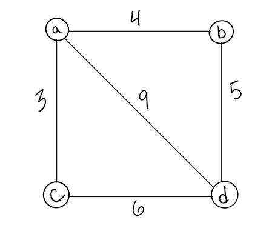
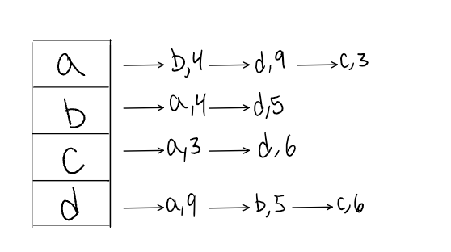

## Graphs

A _**graph**_ is a non-linear data structure that can be looked at as a collection of _**vertices**_ (or _**nodes**_) potentially connected by line segments named _**edges**_.

### Terminology

_**Vertex**_ - A vertex, also called a “node”, is a data object that can have zero or more adjacent vertices.  
_**Edge**_ - An edge is a connection between two nodes.  
_**Neighbor**_ - The neighbors of a node are its adjacent nodes, i.e., are connected via an edge.  
_**Degree**_ - The degree of a vertex is the number of edges connected to that vertex.

An _**Undirected**_ Graph is a graph where each edge is undirected or bi-directional. This means that the undirected graph does not move in any direction.

    

A _**Directed**_ Graph also called a _**Digraph**_ is a graph where every edge is directed.Unlike an undirected graph, a Digraph has direction. Each node is directed at another node with a specific requirement of what node should be referenced next.

    

A _**Complete Graph**_ is when all nodes are connected to all other nodes.

    

A _**connected graph**_ is graph that has all of vertices/nodes have at least one edge.

    

A _**disconnected graph**_ is a graph where some vertices may not have edges.

    

An _**acyclic graph**_ is a directed graph without cycles. A _**cycle**_ is when a node can be traversed through and potentially end up back at itself.

    

A _**cyclic graph**_ is a graph that has cycles. A cycle is defined as a path of a positive length that starts and ends at the same vertex.

### Graph Representation

An _**adjacency matrix**_ is represented through a 2-dimensional array. If there are n vertices, then we are looking at an n x n Boolean matrix. Each Row and column represents each vertex of the data structure. The elements of both the column and the row must add up to 1 if there is an edge that connects the two, or zero if there isn’t a connection. A _**sparse**_ graph is when there are very few connections, a _**dense**_ graph is when there are many connections

    

An _**adjacency list**_ is the most common way to represent graphs. An adjacency list is a collection of linked lists or array that lists all of the other vertices that are connected. Adjacency lists make it easy to view if one vertices connects to another.

    

### Weighted Graphs

A _**weighted graph**_ is a graph with numbers assigned to its edges. These numbers are called weights. This is what a weighted graph looks like:

    

When representing a weighted graph in a matrix, you set the element in the 2D array to represent the actual weight between the two paths. If there is not a connection between the two vertices, you can put a 0, although it is known for some people to put the infinity sign instead.

    

Within adjacency lists, you must include both the weight and the name of the adjacent vertex.

    

### Traversals

#### Breadth First:

- Enqueue the declared start node into the Queue.
- Create a loop that will run while the node still has nodes present.
- Dequeue the first node from the queue
- if the Dequeue‘d node has unvisited child nodes, mark the unvisited children as visited and re-insert them back into the queue.

        ALGORITHM BreadthFirst(vertex)
        DECLARE nodes <-- new List()
        DECLARE breadth <-- new Queue()
        breadth.Enqueue(vertex)

        while (breadth is not empty)
        DECLARE front <-- breadth.Dequeue()
        nodes.Add(front)

                for each child in front.Children
                    if(child is not visited)
                        child.Visited <-- true
                        breadth.Enqueue(child)

        return nodes;

#### Depth First

- Push the root node into the stack
- Start a while loop while the stack is not empty
- Peek at the top node in the stack
- If the top node has unvisited children, mark the top node as visited, and then Push any unvisited children back into the stack.
- If the top node does not have any unvisited children, - Pop that node off the stack
- repeat until the stack is empty.

[Go back](./README.md)
